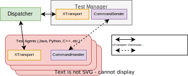
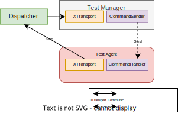

= Eclipse uProtocol TCK Library 
:toc:

== Overview

This library implements the uProtocol Test Compatibility Kit for the use of a Test Manager and Test Agents. A Test Manager will be responsible for sending commands to multiple connected Test Agents. The Test Agents, in turn, will carry out the tests specified in the commands, and return results back to the Test Manager for validation and processing.


== Getting Started

=== Prerequisites
Set up up-python

----
$ git clone https://github.com/eclipse-uprotocol/up-python.git
$ cd up-python
$ pip install .
----

=== Importing the up-tck-python
 
Set up upclient-socket-python local repository and install
[source]
----
$ git clone https://github.com/eclipse-uprotocol/up-tck.git
$ cd up-tck/python
$ pip install .
----
*This will install the up-tck-python, making its classes and modules available for import in your python code.*

=== Building Java Test Agent Jar

If you would like to run any tests with the Java Test Agent, follow these instructions:

1. In Eclipse, open the existing Java Maven project located in the folder up-tck\java\java_test_agent 
* If there are errors when importing a java folder, here is a guide: https://crunchify.com/mavenmvn-clean-install-update-project-and-project-clean-options-in-eclipse-ide-to-fix-any-dependency-issue/
* If Maven option is not found after right-clicking the java_test_agent Java Project, follow this: https://stackoverflow.com/questions/10362166/maven-option-is-not-found-in-eclipse
* If "Maven build ..." does not work with the goal "mvn clean install", then set the goal as "clean install"

2. To create a JAR file of the java_test_agent Java project, goto File -> Export -> Runnable JAR File -> Launch configuration: "Main - java_test_agent" -> (Update Export Destination e.g. Downloads) -> Library handling: Extract required libraries into generated JAR -> Finish

=== Running BDD Tests

Behave is a python implementation of the BDD (Behavior Driven Development) style of testing. With Behave, users can create files called "feature files," within which a test is written out in natural language.

For testing interoperability between different language test agents, users can create these feature files, specifying which languages are under test. Specific step definitions for the test manager and test agents are located under BDD/README.adoc.

==== Running BDD Example Test

Example scripts for TCK Interoperability are supplied under BDD/features/tests. To run these example tests:

1. Go to the BDD Folder (cd BDD)
2. Run "pip install -r requirements.txt"
3. Run "behave -i <feature file name>" (ex. "behave -i register_and_send.feature)

=== Running Test Manager and Test Agent Examples

Test Manager uses the test_runner.txt file in the python/examples/tck_interoperability folder to define and run tests between the Test Manager and Test Agents.
Inside the test_runner.txt file, you will find various statements that can be used to trigger Test Manager behaviors.
To learn more about this grammar, please refer to the bottom section.

==== Running Python Test Manager and Java Test Agent (JAR file)

1. Run the dispatcher: ```python up-tck/python/dispatcher/dispatcher.py```

2. Run the Test Manager: ```python up-tck/python/examples/tck_interoperability/test_socket_tm.py```

3. To run the Java Test Agent, double-click the newly created JavaTestAgent.jar

==== Running Python Test Manager and Python Test Agent

If you would like to run the python Test Manager and Test Agent automatically in Windows, triggering your test_runner.txt file, run python\examples\tck_interoperability\demo_windows.bat


In Linux, to run the python Test Manager and Test Agent manually, run the following commands, each command running in a separate terminal:
----
$ cd .\python\dispatcher\
$ python .\dispatcher.py
----
----
$ cd .\python\examples\tck_interoperability\
$ python .\test_socket_tm.py
----
----
$ cd .\python\examples\tck_interoperability\
$ python .\test_socket_ta.py
----

=== Running up-tck-python Socket-UTransport examples

To run the examples...

----
$ cd .\python\dispatcher\
$ python .\dispatcher.py
----
----
$ cd .\python\examples\up-client-socket-python\
$ python .\test_listener.py
----
----
$ cd .\python\examples\up-client-socket-python\
$ python .\test_sender.py
----

=== Cleaning Up

Clean up by running the command:
`python clean_project.py`

=== Appendix: Test Manager grammar 

    <stmt-seq> := <stmt> | <stmt><stmt-seq>

    <stmt> := <register_listener> | <send> | <responds_ustatus>
    
    <register_listener> := "enactor" register_listener_command "receiver" | 
        "enactor" register_listener_command "receiver" 
        { 
            <param-list>  
        }

    <send> := "enactor" send_command "receiver" | 
        "enactor" register_listener_command "receiver" 
        { 
            <param-list>  
        }

    <responds_ustatus> := "enactor" responds_ustatus "receiver" | 
        "enactor" responds_ustatus "receiver" 
        { 
            <param-list>  
        }

    <param-list> := <param> | <param><param-list> 
    
    <param> := <variable> = "string" | 
        <variable> = { 
            <param-list> 
        }

    <variable> := UUrI | UPAYLOAD | CLOUDEVENT | UAttributes | id | source
    

== Diagrams



Figure 1: Test Manager --> Test Agent Communication Pattern


Figure 2: Test Manager --> Test Agent RegisterListener Command Flow



Figure 3: Test Manager --> Test Agent Send Command Flow