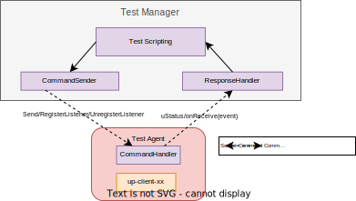
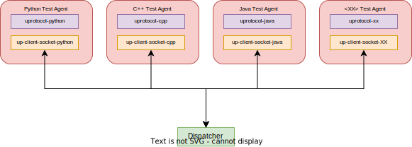
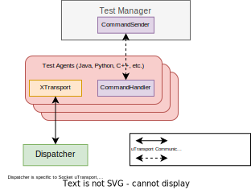

= Eclipse uProtocol TCK Library 
:toc:

== Overview

This library implements the uProtocol Test Compatibility Kit for the use of a Test Manager and Test Agents. A Test Manager will be responsible for sending commands to multiple connected Test Agents. The Test Agents, in turn, will carry out the tests specified in the commands, and return results back to the Test Manager for validation and processing.

== Getting Started

=== Prerequisites
Set up up-python

----
$ git clone https://github.com/eclipse-uprotocol/up-python.git
$ cd up-python
$ pip install .
----

=== Importing the up-tck-python
 
Set up upclient-socket-python local repository and install
[source]
----
$ git clone https://github.com/eclipse-uprotocol/up-tck.git
$ cd up-tck/python
$ pip install .
----
*This will install the up-tck-python, making its classes and modules available for import in your python code.*

=== Building Java Test Agent Jar

If you would like to run any tests with the Java Test Agent, follow these instructions:

1. Inside a terminal/command prompt, go to java_test_agent folder (cd java/java_test_agent).
2. Run "mvn clean install". This will generate the JavaTestAgent JAR file under the target folder.

=== Running BDD Tests

For information about running BDD Tests, refer to BDD/README.adoc

=== Cleaning Up

Clean up by running the command:
`python ./python/clean_project.py`

== Diagrams

*Figure 1: Test Manager --> Test Agent: Trigger Send/RegisterListener/UnregisterListener*

*Figure 2: Test Agent: Dispatcher Communication*

The Dispatcher is a socket-utransport-specific module, created to quickly test SDK Interoperability.

*Figure 3: Test Manager --> Test Agent: Integrated Communication*